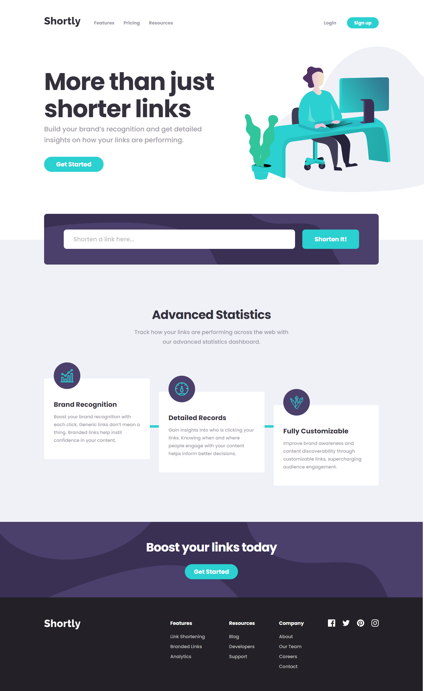
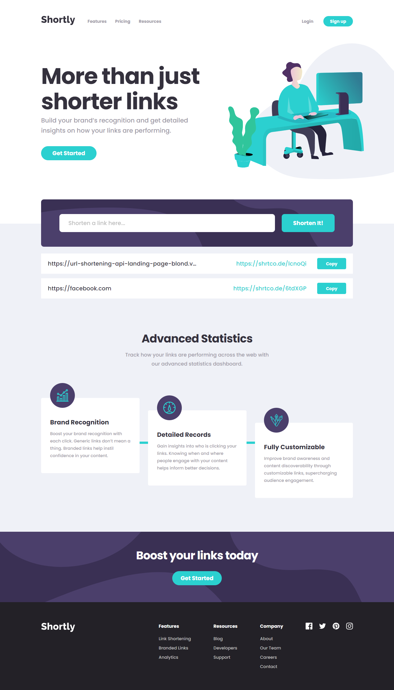

# Frontend Mentor - Shortly URL shortening API Challenge solution

This is a solution to the [Shortly URL shortening API Challenge challenge on Frontend Mentor](https://www.frontendmentor.io/challenges/url-shortening-api-landing-page-2ce3ob-G). Frontend Mentor challenges help you improve your coding skills by building realistic projects. 

### The challenge

Users should be able to:

- View the optimal layout for the site depending on their device's screen size
- Shorten any valid URL
- See a list of their shortened links, even after refreshing the browser
- Copy the shortened link to their clipboard in a single click
- Receive an error message when the `form` is submitted if:
  - The `input` field is empty

### Screenshot

I am pleased to present my solution for the Shortly URL shortening API Challenge. My solution offers a streamlined and efficient method for shortening lengthy URLs, catering to user convenience and rapid access. It ensures precision in link transformation and maintains a user-friendly experience across various platforms. Overall, my solution not only meets the challenge's requirements but also enhances the URL shortening experience with a focus on simplicity and efficiency.

### Links

- Live Site URL: [URL shortening API](https://url-shortening-api-landing-page-blond.vercel.app)

### Built with

- HTML
- SASS
- Vanilla JS

## Author

- Website - [Jownsu](https://jownsu.github.io/)
- Frontend Mentor - [@jownsu](https://www.frontendmentor.io/profile/jownsu)
- Instagram - [jownsu](https://www.instagram.com/jownsu/)
- Linked In - [Jhones](https://www.linkedin.com/in/jhones-digno-866904213/)
